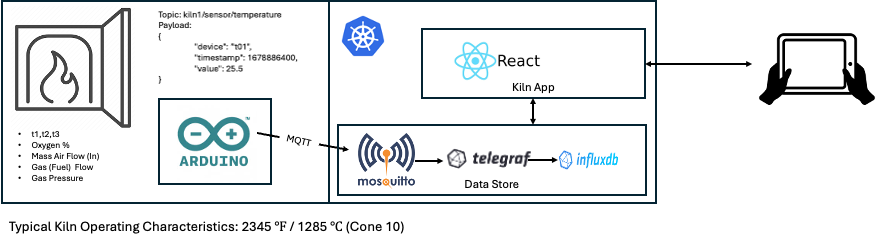

# Connected-Kiln
### Objectives:
1. Begin collecting operational data from real world cermaics kilns using Ardunio hardware
2. Publish operational data to a cloud-based datastore
3. Leverage the data generated to create a tinyML model that provides predictive features to the kiln operation
4. Evaluate if the resulting ML model could be leveraged for combustion controls

### Hope to achieve:
- Increased fuel efficiency
- Firing automation for natural gas kiln, including temperature down ramps
- Strict reduction control to optimize glaze performance and fuel consumption


## Prerequisites
For this project, we're using a k3s Cluster, on site (LAN / WIFI)

````
Client Version: v1.32.0
Kustomize Version: v5.5.0
Server Version: v1.31.9+k3s1
````
3 node master VM's running Redhat Linux 9.5, 2 CPU / 32 GB Memory / 200GB Storage each.
Host Server: Dell Edge 150 with Load Balancer HAPROXY to manage communications to the cluster

Key microservices in place (in addition to default k3s features:

- Grafana-Loki-Alloy: Log Analytics
- Cert Manager: Certificate management and automation
- Kubernetes Gateway API / Istiod: Ingress to the cluster
- Longhorn: Distributed Block Storage Platform
- Sealed Secrets: Encryption of kubernetes secrets
- Schooner: Kubernetes Dashboard
- Velero: Backup / Recovery (Backblaze off site storage)

It is assumed that these components are installed, tested and ready for usage. The cluster must be stable and any open issues resolved. 
As an alternate, you could standup a default k3s single node environment and do most of the work as below. BUT, this guide leverages the latest 
Kubernetes Gatway API and not Traefik.

## Detailed Kubernetes Components


## Initialization

Create a working directory on your local client and make sure the following CLI tools are available:
- kubectl (also, you are connected to your local/remote kubernetes cluster)
- velero (if you have implemented velero as your cluster backup tooling)
- mosquitto_pub (Available for mac/linux thru brew install mosquitto)

Test your connection to your kubernetes system:
````
kubectl get nodes
NAME        STATUS   ROLES                       AGE    VERSION
vm10-lab1   Ready    control-plane,etcd,master   146d   v1.31.9+k3s1
vm11-lab1   Ready    control-plane,etcd,master   145d   v1.31.9+k3s1
vm12-lab1   Ready    control-plane,etcd,master   145d   v1.31.9+k3s1
````
Clone the repo:
````
git clone git@github.com:majones-services/connected-kiln.git

cd connected-kiln
````
Using kubectl, implement the new namespace to organize the needed microservices
````
kubectl apply -f connected-kiln-ns.yaml
````
This command will create the connected-kiln namespace that is used throughout the configuration. 

## Eclipse Mosquitto Broker

Installation steps:

Step 1: Run the following kubectl commands:
````
cd mosquitto
kubectl apply -f mosquitto-pvc.yaml
kubectl apply -f mosquitto-configmap.yaml
kubectl apply -f mosquitto-deployment.yaml
kubectl apply -f mosquitto-service.yaml
````
These commands will:
- create a persistent volume claim (1Gi)
- create the mosquitto configmap
- Deploy mosquitto as a ReplicaSet, running on port 1883 with a ClusterIP
- Mosquitto 2.02.22 will be deployed

Test connections:
To test the broker, a simple method would be as follows:
````
kubectl port-forward service/mosquitto-service 1883:1883 -n connected-kiln
mosquitto_pub -h localhost -p 1883 -t "kiln/furnace/01"  -m "{\"temp\": 1250, \"pressure\": 1.15, \"device_id\": \"kiln-01\"}"
````
You can review the logs of the mosquitto pod with the following:
````
kubectl get pods -n connected-kiln
NAME                         READY   STATUS    RESTARTS   AGE
mosquitto-587458f655-4845k   1/1     Running   0          45h
kubectl logs pod/mosquitto-587458f655-4845k -n connected-kiln
1761752127: New connection from 127.0.0.1:38958 on port 1883.
1761752127: New client connected from 127.0.0.1:38958 as auto-328FAE4A-93D6-DE44-0FD6-8596B33DC32C (p2, c1, k60).
1761752127: Client auto-328FAE4A-93D6-DE44-0FD6-8596B33DC32C disconnected.
````
Connection is confirmed
## Data Store installation (InfuxDB / Telegraf)
The YAML files needed to configure the influxDB and it's connector to MQTT: Telegraf are localed in the "database" dir.
````
cd connected-kiln 
kubectl apply -f ./database/ 
````
This installation will result in InfluxDB and Telegraf plus related services being installed. Notes about the configmap for telegraf:
- The telegraf configmap defines a couple of key values (update as you see fit):
  - Bucket: kiln_metrics
  - Organization: connected-kiln-org
  - Default topic that Telegraf listens for: kiln/#
  - DeviceID is the Tag and then all the other values are fields
- InfluxDB deployment yaml contains the db passwords you'd like to be used. Set them to what every you want. If, after you install you'd like to update them:
````
kubectl get pods -n connected-kiln

NAME                         READY   STATUS    RESTARTS   AGE
influxdb-98f864db7-d59d9     1/1     Running   0          44h
mosquitto-587458f655-4845k   1/1     Running   0          45h
mosquitto-test-client        1/1     Running   0          45h
telegraf-6c5fc6fdb8-vq8gn    1/1     Running   0          18h

kubectl exec -it influxdb-98f864db7-d59d9 -n connected-kiln -- sh

$ influx auth create --org connected-kiln-org --write-bucket kiln_metrics -d "Telegraf Collector Token"
````
The output of the influx command will be the following data:
````
ID: 0fb5ce466ab71000
Description: New Admin Token for Telegraf/Grafana
Token: <yours will be a unique token>
User Name: influxadmin
User ID: 0fb5c4125f8fb000
Permissions: <LONG STRING of everything the admin has access to>
````
- Telegraf log does not show a connection by default: you can add debug log level, its commented out in the configmap
